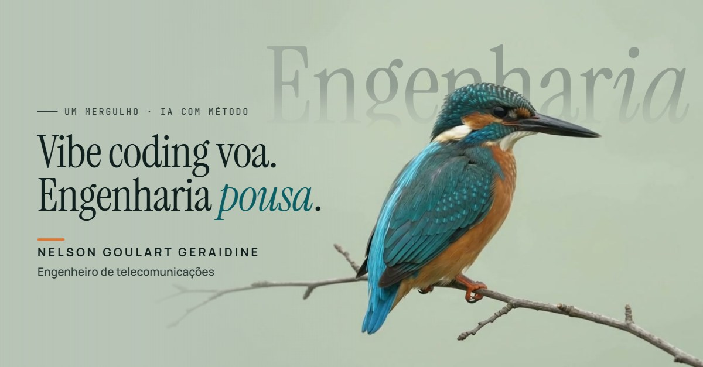

# Um Mergulho

Data de Atualização: 05-10-2026_Versão 1.00

Landing page de **Nelson Goulart Geraidine**, engenheiro de telecomunicações, que demonstra na prática o que engenharia assistida por IA com método entrega.

> Vibe coding voa. Engenharia pousa.

A página é a prova: um arquivo, zero frameworks, cada comportamento descrito antes da primeira linha de código. A especificação completa, com todas as decisões tomadas no caminho, está em [PRD.md](PRD.md).

## O que tem de interessante aqui

**O pássaro na frente da palavra, sem máscara.** A palavra "Engenharia" fica atrás do martim-pescador usando `mix-blend-mode: darken`: em cada pixel o navegador mantém o tom mais escuro entre a palavra e o vídeo. Como o pássaro é mais escuro que a palavra, ele parece voar na frente dela. Sem recorte, sem canal alfa, sem máscara quadro a quadro.

**A página se ajusta à filmagem.** Ao carregar, o script lê um pixel do canto do vídeo e usa essa cor como fundo da página, para não aparecer emenda entre vídeo e interface.

**A interface espera o pouso.** Os elementos aparecem quando o pássaro pousa no galho (4,3 s), em sequência escalonada.

**Nunca fica em branco.** A interface aparece mesmo quando algo dá errado. Os seis cenários de falha são tratados no código:

1. vídeo bloqueado;
2. vídeo travado (limite de 9 s);
3. reprodução automática recusada pelo navegador;
4. JavaScript desativado;
5. leitura de cor bloqueada;
6. fonte indisponível.

A página também respeita a preferência de movimento reduzido do sistema.

## Estrutura

| Arquivo | Papel |
|---|---|
| `index.html` | A página inteira: HTML, CSS e JavaScript inline, sem build |
| `hero.mp4` | Vídeo do hero (1280×720, 8 s), hospedado junto da página |
| `og.jpg` | Imagem de prévia para compartilhamento (1200×627) |
| `PRD.md` | Especificação, registro de decisões, critérios de aceitação e histórico de versões |
| `PRODUCT.md` | Público, posicionamento e compromissos do produto |
| `CLAUDE.md` | Regras de trabalho usadas na construção assistida por IA |
| `visualizar.bat` | Abre a página localmente com um clique (Windows) |

## Como rodar localmente

A página precisa ser servida por HTTP. Abrir o arquivo direto (`file://`) faz a leitura de cor do vídeo cair no valor padrão.

- **Windows:** dois cliques em `visualizar.bat`. Ele sobe um servidor local em `http://localhost:8080` e abre o navegador.
- **Qualquer sistema:** `npx serve .` ou `python -m http.server 8080` na pasta do projeto. O servidor do Python não aceita requisições parciais (Range), então o botão REPETIR pode não reiniciar o vídeo.

## Publicação

Site estático, sem comando de build: basta importar este repositório na Vercel. Depois do primeiro deploy, troque `SEU-PROJETO` pela URL real no bloco `TODO APÓS PUBLICAR` do `<head>` e descomente as metas `og:url` e `og:image`.

## Créditos

Vídeo e conceito original: [thinkingods.com](https://thinkingods.com/), uso autorizado.

## Contato

[LinkedIn](https://www.linkedin.com/in/nelsonggeraidine) · [Instagram](https://www.instagram.com/nelsonggeraidine/)
